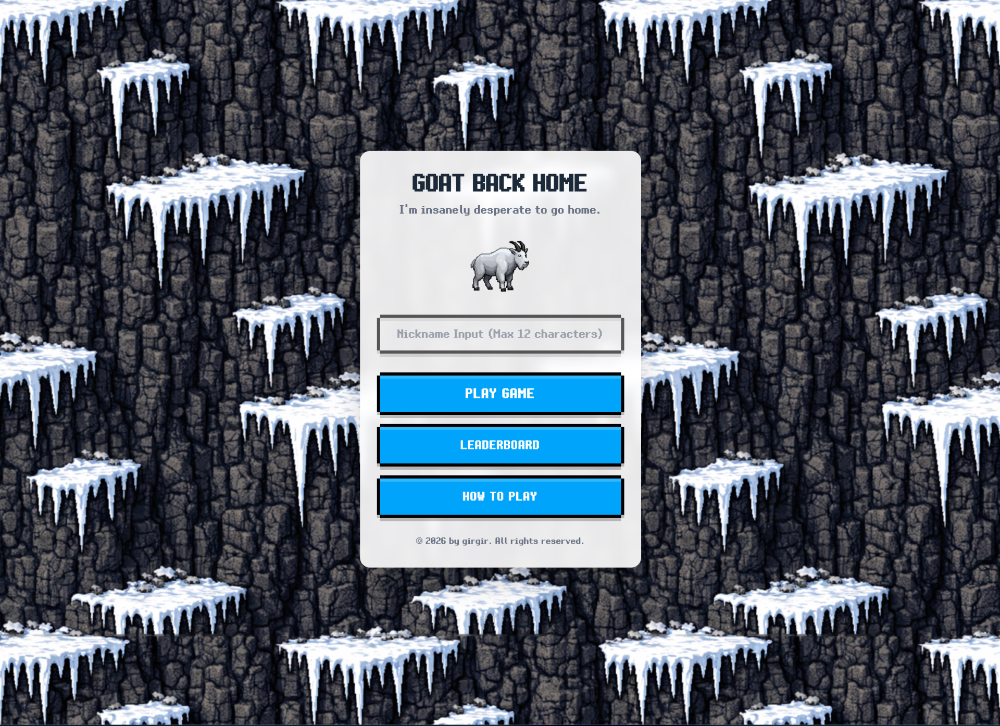
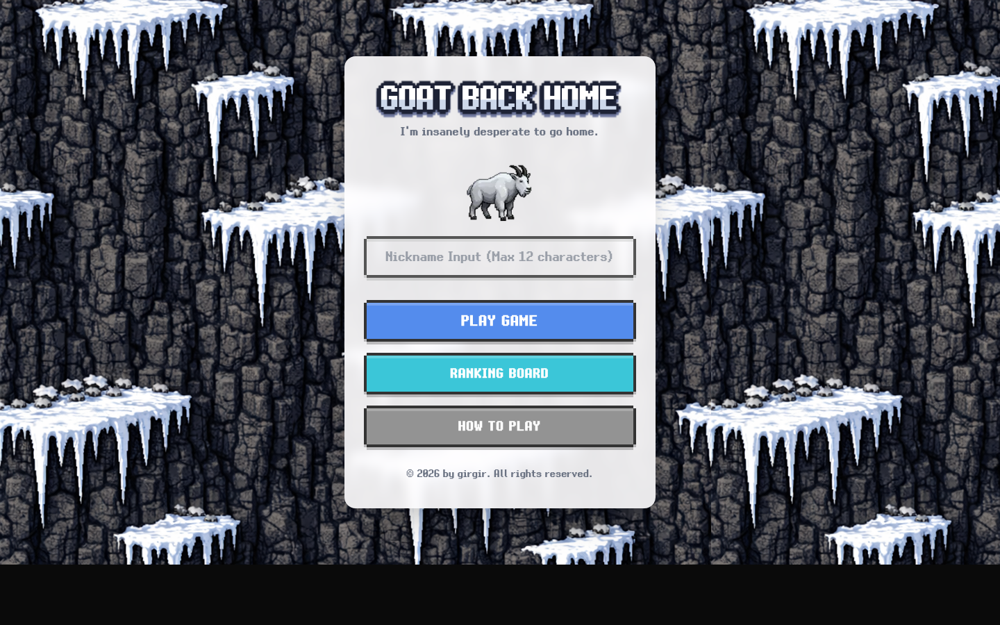
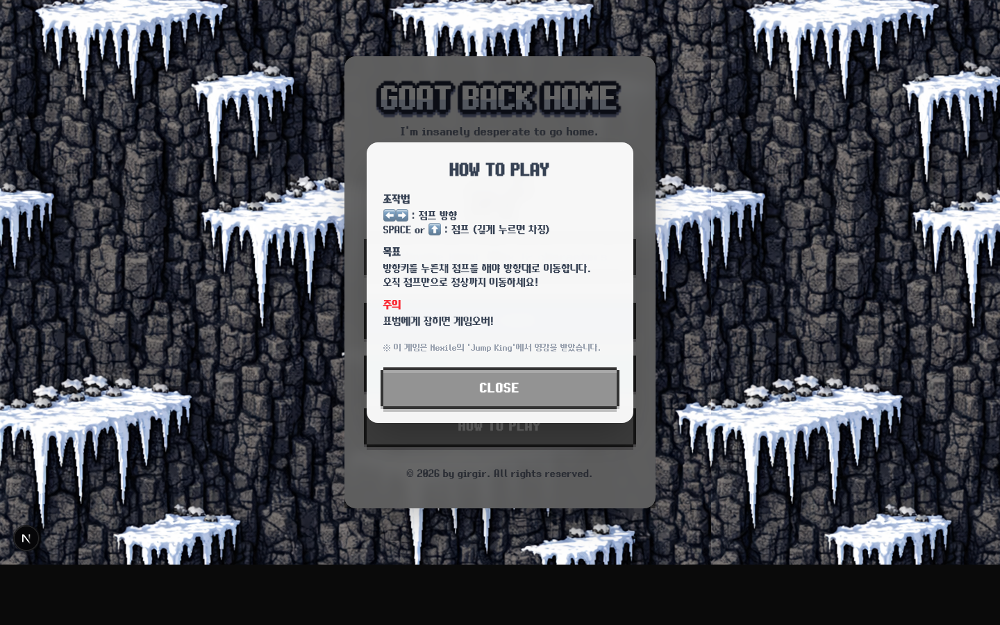
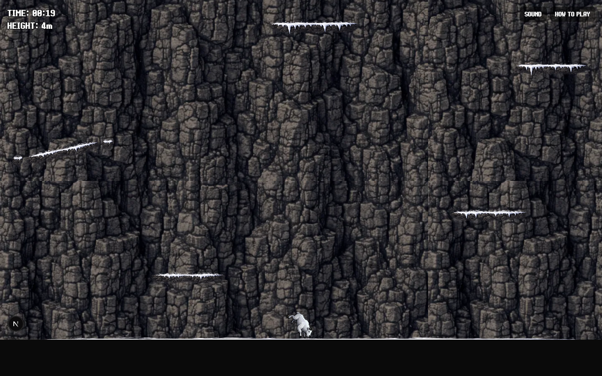
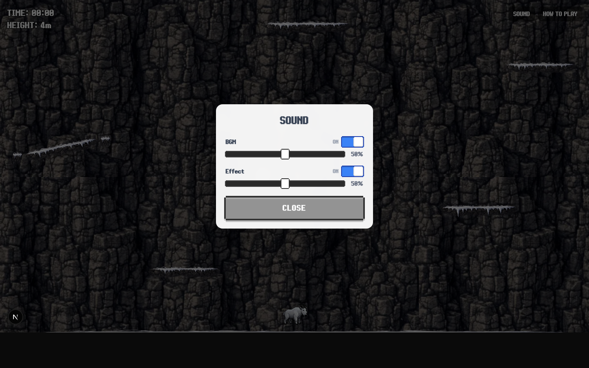
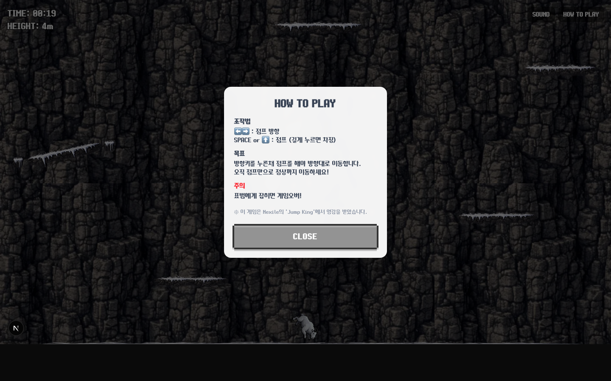
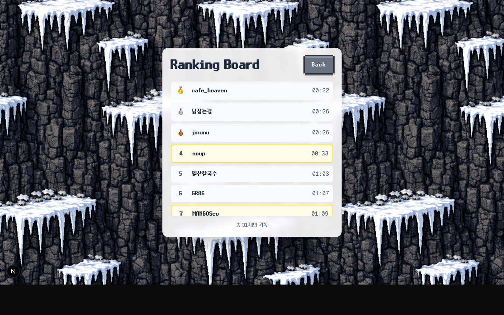

# Goat Back Home

[플레이하기: https://goat-back-home.vercel.app/](https://goat-back-home.vercel.app/)



점프킹 스타일의 고난도 2D 플랫포머 게임입니다. 플레이어는 산양이 되어 산을 오르고, 추락해도 다시 올라가며 기록을 단축합니다.

## 1) 게임 개요

- 장르: 하드코어 2D 점프 플랫포머
- 코어 루프: `차징 → 점프 → 착지/추락 → 재도전`
- 목표: 최상단 골 지점 도달 후 최단 시간 기록
- 실패 조건: 설표(`Snow Leopard`)와 접촉 시 즉시 게임오버
- 리텐션 포인트: 기록 경쟁(랭킹), 반복 숙련, 물리 기반 실수/복구

## 2) 게임 컨셉과 주요 포인트

### 컨셉
- "간단한 조작, 어려운 난이도"를 중심으로 설계된 도전형 게임
- 체크포인트 없이 누적 실수를 감당해야 하는 긴장감
- 실력 향상 체감이 분명한 구조 (점프 파워/방향 제어 숙련)

### 핵심 포인트
- 점프 차징 시스템: 홀드 시간에 비례해 파워 상승
- 방향 결정 시스템: 좌/우 입력과 차징의 조합으로 포물선 점프
- 장애물 패턴
- `Bird`: 왕복 비행 + 넉백
- `Snow Leopard`: 감지 후 추격, 접촉 시 게임오버
- 환경 난이도: 평지/경사/얼음 발판, 구간별 배치 난이도 변화
- 모바일 대응: 가상 컨트롤러(좌/우/점프)

## 3) 기술 스펙

| 영역 | 스택 |
|---|---|
| FE Framework | Next.js 16 (App Router), React 19 |
| Language | TypeScript |
| Game Engine | Phaser 3.90 (Matter Physics) |
| State | Zustand |
| Styling | Tailwind CSS 4 |
| DB/BaaS | Supabase PostgreSQL |
| Deploy | Vercel |

## 4) 게임 기획 + FE 아키텍처 + 시스템 설계

### 4-1. 게임 기획 관점
- 플레이어 행동 단위
- 입력: 키보드(`← →`, `SPACE/↑`) 또는 모바일 터치
- 상태: 지상/공중/차징/점프/낙하
- 결과: 높이/시간 누적, 클리어 시 기록 저장
- 밸런스 파라미터(코드 상수화)
- `GAME_CONSTANTS.MAX_JUMP_POWER`, `CHARGE_RATE`, `PLAYER_FRICTION`, `BIRD_SPEED`, `LEOPARD_SPEED` 등
- 난이도 설계 자산
- 맵/장애물 데이터: `src/lib/phaser/utils/mapGenerator.ts`
- 데스크톱/모바일 맵 분리: `getMapDataForScreen(isMobile)`

### 4-2. FE 아키텍처
- 라우팅
- `/` : 메인 메뉴 + 닉네임 입력 + How To Play 모달
- `/game` : Phaser 캔버스 마운트
- `/leaderboard` : 점수 랭킹 조회 UI
- `/api/scores` : 점수 저장/조회 API
- React ↔ Phaser 브릿지
- `GameCanvas`가 Phaser 인스턴스 lifecycle 관리
- 커스텀 이벤트 기반 동기화
- 로딩: `loadProgress`, `gameReady`
- 오디오: `audioSettingsChanged`
- 일시정지/재개: `gamePauseRequest`, `gameResumeRequest`
- 상태 관리
- `audioStore`: 볼륨/뮤트/사운드 모달 상태
- `gameStore`: 게임 데이터 상태(확장용)

### 4-3. 시스템 설계
- Scene 구조
- `PreloadScene`: 에셋 로딩 + 로딩 이벤트 전달
- `GameScene`: 맵/플레이어/장애물/HUD/충돌/클리어 처리
- `GameOverScene`: 결과 UI + 점수 저장
- 랭킹/기록 저장 정책
- `player_id` 기준 업서트 유사 동작 (더 빠른 기록만 갱신)
- 순위 계산: `clear_time` 기준 오름차순
- Supabase 미설정 시 개발용 Mock 응답 반환
- DB 마이그레이션
- `supabase/migrations/001_add_player_id.sql`
- `scores.player_id` 유니크 인덱스, 중복 정리, UPDATE 정책

### 4-4. 데이터 플로우

```text
[User Input]
  -> React Page(/game)
  -> GameCanvas
  -> Phaser(GameScene)
  -> Clear Event(GameOverScene)
  -> POST /api/scores
  -> Supabase(scores table)
  -> GET /api/scores (leaderboard)
  -> /leaderboard UI render
```

## 5) 화면 캡처

### 메인/모달



### 게임/모달




### 랭킹


## 6) 프로젝트 구조

```text
src/
  app/
    page.tsx                # 메인 메뉴
    game/page.tsx           # 게임 화면
    leaderboard/page.tsx    # 랭킹 화면
    api/scores/route.ts     # 점수 저장/조회 API
  components/
    game/GameCanvas.tsx     # Phaser 마운트/브릿지
    ui/HowToPlayModal.tsx
    ui/SoundSettingsModal.tsx
  lib/
    phaser/
      scenes/               # Preload, Game, GameOver
      entities/             # Player, Bird, SnowLeopard
      ui/VirtualController.ts
      utils/mapGenerator.ts
    supabase.ts
  store/
    audioStore.ts
    gameStore.ts
supabase/migrations/
```

## 7) 실행 방법

```bash
npm install
npm run dev
```

브라우저에서 `http://localhost:3000` 접속

## 8) 환경 변수

`.env.local`에 아래 값이 필요합니다.

```bash
NEXT_PUBLIC_SUPABASE_URL=...
NEXT_PUBLIC_SUPABASE_ANON_KEY=...
```

미설정 시 `/api/scores`는 개발용 Mock 데이터로 동작합니다.

## 9) 참고 파일

- 기획 문서: `GoatBackHome.md`
- 핵심 씬: `src/lib/phaser/scenes/GameScene.ts`
- 맵/장애물 데이터: `src/lib/phaser/utils/mapGenerator.ts`
- API: `src/app/api/scores/route.ts`
